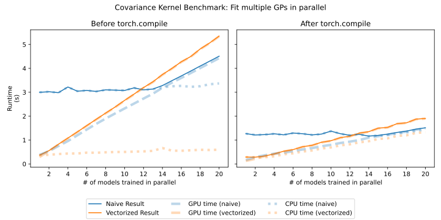

# MNIST and GPs and BO

This is an example project using outerloop.

Things you can do:

- Generate mnist results using random configs. (This output is already stored in [mnist_project/results/](results/).)

```bash
python run_sweep.py --sweep-name mnist1
```

- Fit a GP to results, run cross-validation.

```bash
python run_cross_validation.py --sweep-name mnist1 --model-name VexprHandsOnLossModel
```

- Plot the GP results in [plot.ipynb](plot.ipynb)

- Run CUDA performance tests

```
./benchmark_fit_save_data.sh
python benchmark_fit_plot.py
```

Result:




<!--


- Run an individual MNIST experiment using the best known config

```bash
python run_mnist.py
```

- Run a distributed hyperparameter sweep on an MNIST experiment:

```bash
python run_sweep.py --sweep-name mnist1
```


- Run a single run of Bayesian Optimization

```bash
python run_bo.py --model-name [todo] --sweep-name [todo]
```

- Run performance test on GP

```python
python run_gp_performance_test.py --model-name [todo] --sweep-name [todo]
```

-->
